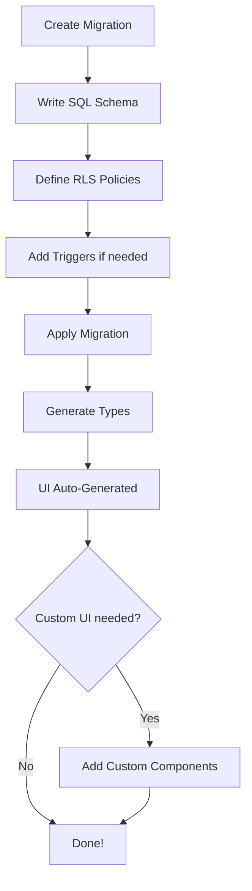

## The SQL-First Paradigm

Supasheet follows a **SQL-first approach** where most of your application logic lives in the database rather than application code. This paradigm shift offers several advantages:

- **Single Source of Truth**: Your database schema defines your UI
- **Less Code**: No need to write CRUD controllers, API endpoints, or forms
- **Type Safety**: Auto-generated TypeScript types from your schema
- **Performance**: Database-level operations are faster than application-level
- **Security**: Row Level Security (RLS) enforced at the database layer

## Core Principles

### 1. Schema-Driven UI

When you create a table or view, Supasheet **automatically generates** the appropriate UI:

```sql
CREATE TABLE products (
  id UUID PRIMARY KEY DEFAULT gen_random_uuid(),
  name TEXT NOT NULL,
  price DECIMAL(10,2),
  in_stock BOOLEAN DEFAULT true
);
```

This immediately gives you:
- A data table with pagination, sorting, and filtering
- Create/Edit forms with proper validation
- Delete confirmation dialogs
- All styled and ready to use

### 2. JSON Comments for Feature Metadata

Supasheet uses JSON comments on views to define features like charts, dashboards, and reports:

#### Charts
Create views with chart metadata in comments:

```sql
CREATE VIEW public.monthly_revenue AS
SELECT
  DATE_TRUNC('month', created_at) as month,
  SUM(total) as revenue
FROM orders
GROUP BY month;

COMMENT ON VIEW public.monthly_revenue IS '{"type": "chart", "name": "Monthly Revenue", "description": "Revenue trend by month", "chart_type": "line"}';
```

This view automatically appears in your Charts interface.

#### Dashboard Widgets
Define dashboard widgets with JSON metadata:

```sql
CREATE VIEW public.sales_overview AS
SELECT
  COUNT(*) as total_orders,
  SUM(total) as revenue,
  AVG(total) as avg_order_value
FROM orders
WHERE created_at >= NOW() - INTERVAL '30 days';

COMMENT ON VIEW public.sales_overview IS '{"type": "dashboard_widget", "name": "Sales Overview", "description": "30-day sales summary", "widget_type": "card_1"}';
```

#### Reports
SQL views for report generation with type metadata:

```sql
CREATE VIEW public.customer_purchases AS
SELECT
  c.email,
  c.name,
  COUNT(o.id) as order_count,
  SUM(o.total) as lifetime_value
FROM customers c
LEFT JOIN orders o ON c.id = o.customer_id
GROUP BY c.id, c.email, c.name;

COMMENT ON VIEW public.customer_purchases IS '{"type": "report", "name": "Customer Purchases", "description": "Customer lifetime value report"}';
```

### 3. RLS-Based Authorization

Instead of application-level permissions, use PostgreSQL Row Level Security:

```sql
-- Enable RLS
ALTER TABLE orders ENABLE ROW LEVEL SECURITY;

-- Policy: Users can only see their own orders
CREATE POLICY "Users view own orders"
  ON orders
  FOR SELECT
  TO authenticated
  USING (user_id = auth.uid());

-- Policy: Admins can see all orders
CREATE POLICY "Admins view all orders"
  ON orders
  FOR SELECT
  TO authenticated
  USING (
    auth.jwt() ->> 'role' = 'admin'
  );
```

### 4. PostgREST Integration

All tables and views with proper permissions are automatically exposed via Supabase's REST API:

```sql
-- This table is automatically available at:
-- GET /rest/v1/products
-- POST /rest/v1/products
-- PATCH /rest/v1/products?id=eq.{id}
-- DELETE /rest/v1/products?id=eq.{id}
```

### 5. Type Safety

After schema changes, run:

```bash
npm run typegen
```

This generates TypeScript types ensuring type safety across your entire stack:

```typescript
import { Database } from '@/lib/database.types';

type Product = Database['public']['Tables']['products']['Row'];
```

### 6. Trigger-Based Audit Logging

Supasheet includes a built-in audit logging system. Simply attach triggers to your tables to automatically track all changes:

```sql
-- Enable audit logging for insert operations
CREATE TRIGGER audit_products_insert
  AFTER INSERT
  ON public.products
  FOR EACH ROW
EXECUTE FUNCTION supasheet.audit_trigger_function();

-- Enable audit logging for update operations
CREATE TRIGGER audit_products_update
  AFTER UPDATE
  ON public.products
  FOR EACH ROW
EXECUTE FUNCTION supasheet.audit_trigger_function();

-- Enable audit logging for delete operations
CREATE TRIGGER audit_products_delete
  BEFORE DELETE
  ON public.products
  FOR EACH ROW
EXECUTE FUNCTION supasheet.audit_trigger_function();
```

The `supasheet.audit_trigger_function()` automatically captures:
- Table name and operation type (INSERT/UPDATE/DELETE)
- Old and new data values
- User who made the change
- Timestamp of the change

All audit logs are stored in the `supasheet.audit_logs` table and can be viewed in the Audit Logs section of Supasheet.

## The SQL-First Workflow

Here's the typical development process:



## When to Use Application Code

While Supasheet is SQL-first, you should use application code for:

- **Complex UI interactions** not covered by auto-generated interfaces
- **Third-party API integrations** (payment gateways, email services)
- **Business logic** that can't be expressed in SQL
- **Custom workflows** requiring multiple steps

## Benefits of SQL-First

### For Developers
- ⚡ **Faster development** - Less boilerplate code
- 🔒 **Better security** - Database-level authorization
- 🎯 **Type safety** - Auto-generated types
- 📊 **Performance** - Database-optimized queries

### For Businesses
- 💰 **Lower costs** - Less code to maintain
- 🚀 **Faster time-to-market** - Rapid prototyping
- 🔧 **Easy modifications** - Change schema, UI updates automatically
- 📈 **Scalability** - PostgreSQL's proven performance

## Example: Basic Feature in SQL

Here's a basic e-commerce order management feature in just SQL:

```sql
-- Orders table
CREATE TABLE orders (
  id UUID PRIMARY KEY DEFAULT gen_random_uuid(),
  customer_id UUID REFERENCES customers(id),
  total DECIMAL(10,2),
  status TEXT DEFAULT 'pending',
  created_at TIMESTAMPTZ DEFAULT NOW()
);

-- RLS Policies
ALTER TABLE orders ENABLE ROW LEVEL SECURITY;

CREATE POLICY "Customers see own orders"
  ON orders FOR SELECT
  USING (customer_id = auth.uid() OR auth.jwt() ->> 'role' = 'admin');

-- Dashboard widget view
CREATE VIEW public.order_stats AS
SELECT
  COUNT(*) as total_orders,
  SUM(total) as revenue,
  COUNT(*) FILTER (WHERE status = 'pending') as pending_count
FROM orders;

COMMENT ON VIEW public.order_stats IS '{"type": "dashboard_widget", "name": "Order Stats", "description": "Order statistics overview", "widget_type": "card_1"}';

-- Chart view
CREATE VIEW public.daily_orders AS
SELECT
  DATE_TRUNC('day', created_at) as day,
  COUNT(*) as order_count
FROM orders
GROUP BY day
ORDER BY day DESC
LIMIT 30;

COMMENT ON VIEW public.daily_orders IS '{"type": "chart", "name": "Daily Orders", "description": "Daily order trend", "chart_type": "line"}';

-- Audit triggers
CREATE TRIGGER audit_orders_insert
  AFTER INSERT ON orders
  FOR EACH ROW EXECUTE FUNCTION supasheet.audit_trigger_function();

CREATE TRIGGER audit_orders_update
  AFTER UPDATE ON orders
  FOR EACH ROW EXECUTE FUNCTION supasheet.audit_trigger_function();

CREATE TRIGGER audit_orders_delete
  BEFORE DELETE ON orders
  FOR EACH ROW EXECUTE FUNCTION supasheet.audit_trigger_function();
```

This SQL gives you:
- ✅ Full CRUD interface
- ✅ Proper authorization
- ✅ Dashboard statistics
- ✅ Order trend chart
- ✅ Complete audit trail

**Zero application code required!**

## Next Steps

- **[Database Schema](/docs/guide/database-schema)** - Learn about schema organization
- **[CRUD Operations](/docs/guide/crud-operations)** - Deep dive into table management
- **[Authorization](/docs/guide/authorization)** - Master RLS policies
