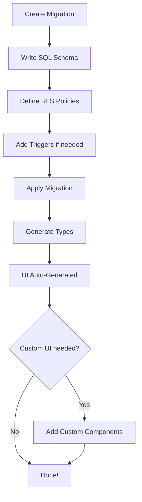

## The SQL-First Paradigm

Supasheet follows a **SQL-first approach** where most of your application logic lives in the database rather than application code. This paradigm shift offers several advantages:

- **Single Source of Truth**: Your database schema defines your UI
- **Less Code**: No need to write CRUD controllers, API endpoints, or forms
- **Type Safety**: Auto-generated TypeScript types from your schema
- **Performance**: Database-level operations are faster than application-level
- **Security**: Row Level Security (RLS) enforced at the database layer

## Core Principles

### 1. Schema-Driven UI

When you create a table or view, Supasheet **automatically generates** the appropriate UI:

```sql
CREATE TABLE products (
  id UUID PRIMARY KEY DEFAULT gen_random_uuid(),
  name TEXT NOT NULL,
  price DECIMAL(10,2),
  in_stock BOOLEAN DEFAULT true
);
```

This immediately gives you:
- A data table with pagination, sorting, and filtering
- Create/Edit forms with proper validation
- Delete confirmation dialogs
- All styled and ready to use

### 2. Custom Schemas for Features

Supasheet uses PostgreSQL schemas to organize different features:

#### `charts` Schema
Create views here for chart data:

```sql
CREATE VIEW charts.monthly_revenue AS
SELECT
  DATE_TRUNC('month', created_at) as month,
  SUM(total) as revenue
FROM orders
GROUP BY month;
```

This view automatically appears in your Charts interface.

#### `dashboards` Schema
Define dashboard data aggregations:

```sql
CREATE VIEW dashboards.sales_overview AS
SELECT
  COUNT(*) as total_orders,
  SUM(total) as revenue,
  AVG(total) as avg_order_value
FROM orders
WHERE created_at >= NOW() - INTERVAL '30 days';
```

#### `reports` Schema
SQL queries for report generation:

```sql
CREATE VIEW reports.customer_purchases AS
SELECT
  c.email,
  c.name,
  COUNT(o.id) as order_count,
  SUM(o.total) as lifetime_value
FROM customers c
LEFT JOIN orders o ON c.id = o.customer_id
GROUP BY c.id, c.email, c.name;
```

### 3. RLS-Based Authorization

Instead of application-level permissions, use PostgreSQL Row Level Security:

```sql
-- Enable RLS
ALTER TABLE orders ENABLE ROW LEVEL SECURITY;

-- Policy: Users can only see their own orders
CREATE POLICY "Users view own orders"
  ON orders
  FOR SELECT
  TO authenticated
  USING (user_id = auth.uid());

-- Policy: Admins can see all orders
CREATE POLICY "Admins view all orders"
  ON orders
  FOR SELECT
  TO authenticated
  USING (
    auth.jwt() ->> 'role' = 'admin'
  );
```

### 4. PostgREST Integration

All tables and views with proper permissions are automatically exposed via Supabase's REST API:

```sql
-- This table is automatically available at:
-- GET /rest/v1/products
-- POST /rest/v1/products
-- PATCH /rest/v1/products?id=eq.{id}
-- DELETE /rest/v1/products?id=eq.{id}
```

### 5. Type Safety

After schema changes, run:

```bash
npm run typegen
```

This generates TypeScript types ensuring type safety across your entire stack:

```typescript
import { Database } from '@/lib/database.types';

type Product = Database['public']['Tables']['products']['Row'];
```

### 6. Trigger-Based Audit Logging

Automatically track changes using PostgreSQL triggers:

```sql
-- Create audit log table
CREATE TABLE audit_logs (
  id UUID PRIMARY KEY DEFAULT gen_random_uuid(),
  table_name TEXT NOT NULL,
  operation TEXT NOT NULL,
  old_data JSONB,
  new_data JSONB,
  changed_by UUID REFERENCES auth.users(id),
  changed_at TIMESTAMPTZ DEFAULT NOW()
);

-- Trigger function
CREATE OR REPLACE FUNCTION log_changes()
RETURNS TRIGGER AS $$
BEGIN
  INSERT INTO audit_logs (table_name, operation, old_data, new_data, changed_by)
  VALUES (
    TG_TABLE_NAME,
    TG_OP,
    CASE WHEN TG_OP = 'DELETE' THEN row_to_json(OLD) ELSE NULL END,
    CASE WHEN TG_OP != 'DELETE' THEN row_to_json(NEW) ELSE NULL END,
    auth.uid()
  );
  RETURN NEW;
END;
$$ LANGUAGE plpgsql;

-- Attach to table
CREATE TRIGGER products_audit
  AFTER INSERT OR UPDATE OR DELETE ON products
  FOR EACH ROW EXECUTE FUNCTION log_changes();
```

## The SQL-First Workflow

Here's the typical development process:



## When to Use Application Code

While Supasheet is SQL-first, you should use application code for:

- **Complex UI interactions** not covered by auto-generated interfaces
- **Third-party API integrations** (payment gateways, email services)
- **Business logic** that can't be expressed in SQL
- **Custom workflows** requiring multiple steps

## Benefits of SQL-First

### For Developers
- ⚡ **Faster development** - Less boilerplate code
- 🔒 **Better security** - Database-level authorization
- 🎯 **Type safety** - Auto-generated types
- 📊 **Performance** - Database-optimized queries

### For Businesses
- 💰 **Lower costs** - Less code to maintain
- 🚀 **Faster time-to-market** - Rapid prototyping
- 🔧 **Easy modifications** - Change schema, UI updates automatically
- 📈 **Scalability** - PostgreSQL's proven performance

## Example: Complete Feature in SQL

Here's a complete e-commerce order management feature in just SQL:

```sql
-- Orders table
CREATE TABLE orders (
  id UUID PRIMARY KEY DEFAULT gen_random_uuid(),
  customer_id UUID REFERENCES customers(id),
  total DECIMAL(10,2),
  status TEXT DEFAULT 'pending',
  created_at TIMESTAMPTZ DEFAULT NOW()
);

-- RLS Policies
ALTER TABLE orders ENABLE ROW LEVEL SECURITY;

CREATE POLICY "Customers see own orders"
  ON orders FOR SELECT
  USING (customer_id = auth.uid() OR auth.jwt() ->> 'role' = 'admin');

-- Dashboard view
CREATE VIEW dashboards.order_stats AS
SELECT
  COUNT(*) as total_orders,
  SUM(total) as revenue,
  COUNT(*) FILTER (WHERE status = 'pending') as pending_count
FROM orders;

-- Chart view
CREATE VIEW charts.daily_orders AS
SELECT
  DATE_TRUNC('day', created_at) as day,
  COUNT(*) as order_count
FROM orders
GROUP BY day
ORDER BY day DESC
LIMIT 30;

-- Audit trigger
CREATE TRIGGER orders_audit
  AFTER INSERT OR UPDATE OR DELETE ON orders
  FOR EACH ROW EXECUTE FUNCTION log_changes();
```

This SQL gives you:
- ✅ Full CRUD interface
- ✅ Proper authorization
- ✅ Dashboard statistics
- ✅ Order trend chart
- ✅ Complete audit trail

**Zero application code required!**

## Next Steps

- **[Database Schema](/docs/guide/database-schema)** - Learn about schema organization
- **[CRUD Operations](/docs/guide/crud-operations)** - Deep dive into table management
- **[Authorization](/docs/guide/authorization)** - Master RLS policies
